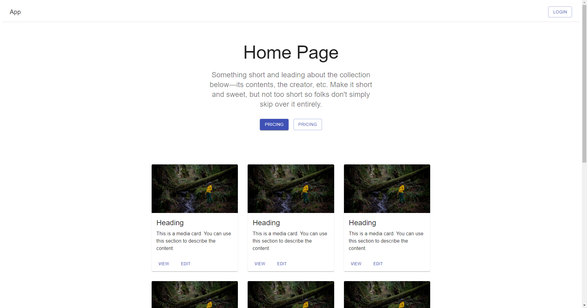
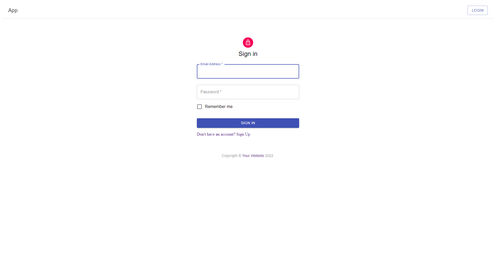
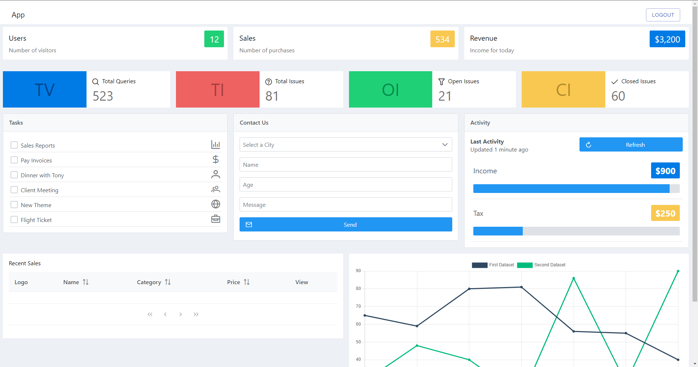

# Micro frontend Dashboard App

A dashboard app utilizing Webpack's Module Federation to test one way to implement micro frontend architecture.
The app was created following Udemy course: [Microfrontends with React: A Complete Developer's Guide](https://www.udemy.com/course/microfrontend-course/) with minor tweaks (such as using `yarn` instead of `npm`, and some minor fixes to dependencies here and there)

The app is running in AWS and can be visited [here](https://d1zmcu0v64isqt.cloudfront.net/)

  
  
  

## About the app
The app has a shell application (container) created with React and three individual micro frontends, capable of running in isolation or within the container:
1. Auth MFE, created in React, running in port 8081
2. Marketing MFE, created in React, running in port 8082
3. Dashboard MFE, created in Vue, running in port 8083

Each app can be visited individually when running the whole app locally by using the correct port.

The course was a good learning experience and touched multiple question marks that I've had before:
- Resolving issues with CSS scoping
  - My initial idea was just namespacing all the MFEs CSS classes manually, but apparently CSS-in-JS handles this well
  - Probably not a major issue with Angular because of how Angular handles scoping
- Resolving issues with routing
  - Subroutes within MFEs use memory routers rather than browser router
  - Shell app uses browser router
- Resolving issues with authentication
  - The course didn't really touch this one properly in my opinion, but to my knowledge it doesn't really matter if using e.g. cookies for authentication: as long as the browser is sending the auth related cookie, all the MFEs within the shell app should be authenticated as well
- Communicating between MFEs
  - My initial thought was that *even* the idea of using callbacks to communicate between MFEs as much as this app does is a bit questionable. But perhaps it can not be avoided: we'll see when I get to start implementing this to an actual production app

## Setup
### Prerequisites
1. Node.js (14.x should work at the very least) and yarn

### How to run
1. Run `yarn` in the root dir
    - This will install all the dependencies for all the individual MFEs and might take a while
2. Run `yarn start`
    - This will start all the individual MFEs
3. Go to `http://localhost:8080`
    - The shell (container) is running on `localhost:8080`. Individual apps are running on `localhost` ports `8081`, `8082` and `8083`.

## Technologies
- React
  - Material-UI component library
- Vue
  - PrimeVue component library
- Webpack with [Module Federation](https://webpack.js.org/concepts/module-federation/) plugin